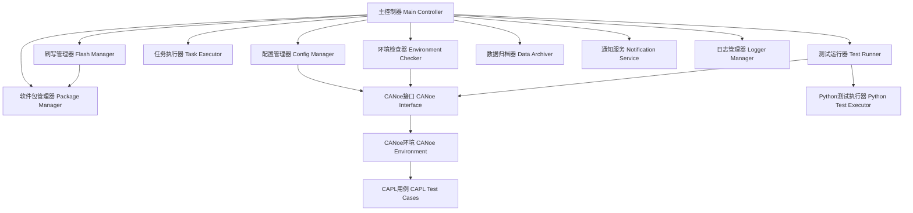

# 设计文档

## 概述

本测试框架采用模块化架构设计，以Python作为主控制器，集成CANoe/CAPL进行配置验证和环境检查。框架支持灵活的测试用例配置、自动化刷写操作、结果归档和邮件通知功能。

## 架构

### 整体架构图



### 模块层次结构

```
test_framework/
├── core/                    # 核心模块
│   ├── main_controller.py   # 主控制器
│   ├── config_manager.py    # 配置管理器
│   └── logger_manager.py    # 日志管理器
├── checkers/                # 检查器模块
│   ├── environment_checker.py  # 环境检查器
│   └── config_validator.py     # 配置验证器
├── executors/               # 执行器模块
│   ├── task_executor.py     # 任务执行器
│   ├── test_runner.py       # 测试运行器
│   └── flash_manager.py     # 刷写管理器
├── interfaces/              # 接口模块
│   ├── canoe_interface.py   # CANoe接口
│   └── python_test_executor.py  # Python测试执行器
├── services/                # 服务模块
│   ├── notification_service.py  # 通知服务
│   ├── data_archiver.py         # 数据归档器
│   └── package_manager.py       # 软件包管理器
├── utils/                   # 工具模块
│   ├── file_utils.py        # 文件工具
│   └── email_utils.py       # 邮件工具
└── config/                  # 配置文件目录
    ├── main_config.json     # 主配置文件
    └── task_config.json     # 任务配置文件
```

## 组件和接口

### 1. 主控制器 (Main Controller)

**职责：** 协调整个测试流程的执行

**接口：**
```python
class MainController:
    def __init__(self, config_path: str)
    def run(self) -> bool
    def stop(self) -> None
    def get_status(self) -> dict
```

**主要流程：**
1. 初始化各个模块
2. 执行配置验证
3. 执行环境检查
4. 读取任务配置
5. 拉取和管理软件包（如需要）
6. 执行刷写操作（如需要）
7. 运行测试用例
8. 归档数据和发送通知

### 2. 配置管理器 (Config Manager)

**职责：** 管理系统配置文件的读取和验证

**接口：**
```python
class ConfigManager:
    def __init__(self, config_path: str)
    def load_main_config(self) -> dict
    def load_task_config(self) -> dict
    def validate_config(self, config: dict) -> bool
    def get_config_value(self, key: str) -> any
```

### 3. CANoe接口 (CANoe Interface)

**职责：** 封装Python与CANoe的交互接口，集成现有的CANoe控制代码

**接口：**
```python
class CANoeInterface:
    def __init__(self, canoe_config: dict)
    # 集成现有CANoe控制功能
    def start_canoe_application(self) -> bool
    def stop_canoe_application(self) -> bool
    def load_configuration(self, config_path: str) -> bool
    def start_measurement(self) -> bool
    def stop_measurement(self) -> bool
    pycanoe所有代码统一集成
```

### 4. 环境检查器 (Environment Checker)

**职责：** 通过CAPL用例检查测试环境状态

**接口：**
```python
class EnvironmentChecker:
    def __init__(self, canoe_interface: CANoeInterface)
    通过canoe用例返回结果检查
```

### 5. 任务执行器 (Task Executor)

**职责：** 解析和管理测试任务配置

**接口：**
```python
class TaskExecutor:
    def __init__(self, config_manager: ConfigManager)
    def parse_task_config(self) -> list
    def validate_task_config(self, config: dict) -> bool
    def get_test_cases(self) -> list
    def should_flash(self) -> bool
```

### 6. 刷写管理器 (Flash Manager)

**职责：** 管理刷写操作和重试机制，集成现有的刷写文件配置更新代码

**接口：**
```python
class FlashManager:
    def __init__(self, config: dict, max_retries: int = 3)
    def validate_flash_files(self) -> bool
    def execute_flash(self) -> bool
    def retry_flash(self) -> bool
    def get_flash_status(self) -> dict
    # 集成现有刷写配置功能
    def update_flash_config(self, flash_file_path: str) -> bool
    def backup_current_config(self) -> str
    def restore_config(self, backup_path: str) -> bool
    def validate_flash_file_integrity(self, file_path: str) -> bool
```

### 7. 测试运行器 (Test Runner)

**职责：** 执行Python和CAPL测试用例

**接口：**
```python
class TestRunner:
    def __init__(self, canoe_interface: CANoeInterface, python_executor: PythonTestExecutor)
    def run_test_suite(self, test_cases: list) -> dict
    def run_single_test(self, test_case: dict) -> dict
    def generate_report(self, results: list) -> dict
```

### 8. 数据归档器 (Data Archiver)

**职责：** 归档测试数据和报告

**接口：**
```python
class DataArchiver:
    def __init__(self, archive_config: dict)
    def create_archive_directory(self) -> str
    def archive_test_data(self, data: dict) -> bool
    def archive_reports(self, reports: list) -> bool
    def cleanup_old_archives(self) -> None
```

### 9. 软件包管理器 (Package Manager)

**职责：** 管理软件包的下载和更新，集成现有的软件包拉取代码

**接口：**
```python
class PackageManager:
    def __init__(self, package_config: dict)
    def download_package(self, package_info: dict) -> str
    def validate_package(self, package_path: str) -> bool
    def extract_package(self, package_path: str, target_dir: str) -> bool
    def get_package_info(self, package_path: str) -> dict
    def cleanup_temp_files(self) -> None
    # 集成现有软件包拉取功能
    def pull_latest_package(self, package_name: str) -> str
    def check_package_updates(self) -> list
    def install_package(self, package_path: str) -> bool
```

### 10. 通知服务 (Notification Service)

**职责：** 发送邮件通知

**接口：**
```python
class NotificationService:
    def __init__(self, email_config: dict)
    def send_error_notification(self, error_info: dict) -> bool
    def send_success_notification(self, test_results: dict) -> bool
    def send_custom_notification(self, subject: str, content: str, attachments: list = None) -> bool
```

## 数据模型

### 配置文件结构

#### 主配置文件 (main_config.json)
```json
{
    "canoe": {
        "application_path": "C:/Program Files/Vector CANoe/CANoe64.exe",
        "configuration_path": "./canoe_configs/test_config.cfg",
        "timeout": 30
    },
    "email": {
        "recipient": "engineer@company.com"
    },
    "logging": {
        "level": "INFO",
        "file_path": "./logs/test_framework.log",
        "max_size": "10MB",
        "backup_count": 5
    },
    "archive": {
        "base_path": "./archives",
        "retention_days": 30
    },
    "package_manager": {
        "repository_url": "https://packages.company.com",
        "download_path": "./downloads",
        "cache_path": "./cache",
        "timeout": 300,
        "auto_update": true
    }
}
```

#### 任务配置文件 (task_config.json)
```json
{
    "task_info": {
        "name": "ECU测试任务",
        "version": "1.0.0",
        "description": "ECU功能测试"
    },
    "package_config": {
        "enabled": true,
        "packages": [
            {
                "name": "ecu_firmware",
                "version": "latest",
                "type": "firmware"
            },
            {
                "name": "test_scripts",
                "version": "1.2.0",
                "type": "scripts"
            }
        ]
    },
    "flash_config": {
        "enabled": true,
        "flash_file_path": "./firmware/ecu_firmware.hex",
        "max_retries": 3,
        "timeout": 120,
        "use_package_manager": true
    },
    "test_cases": [
        {
            "name": "配置文件检查",
            "type": "capl",
            "test_file": "config_check.can",
            "function": "CheckConfiguration",
            "parameters": {
                "config_path": "./config/ecu_config.xml"
            }
        },
        {
            "name": "环境连通性检查",
            "type": "capl", 
            "test_file": "env_check.can",
            "function": "CheckEnvironment",
            "parameters": {}
        },
        {
            "name": "功能测试",
            "type": "python",
            "test_file": "functional_tests.py",
            "test_class": "ECUFunctionalTests",
            "parameters": {
                "test_duration": 300
            }
        }
    ]
}
```

### 测试结果数据模型

```python
@dataclass
class TestResult:
    test_name: str
    test_type: str  # 'python' or 'capl'
    status: str     # 'PASS', 'FAIL', 'ERROR'
    start_time: datetime
    end_time: datetime
    duration: float
    error_message: str = None
    details: dict = None

@dataclass
class TestSuiteResult:
    suite_name: str
    start_time: datetime
    end_time: datetime
    total_tests: int
    passed_tests: int
    failed_tests: int
    error_tests: int
    test_results: List[TestResult]
    summary: dict
```

## 错误处理

### 错误分类和处理策略

1. **配置错误**
   - 配置文件不存在或格式错误
   - 处理：记录错误日志，发送邮件通知，停止执行

2. **环境错误**
   - CANoe连接失败
   - 测试环境不可用
   - 处理：记录错误日志，发送邮件通知，停止执行

3. **刷写错误**
   - 刷写文件不存在
   - 刷写操作失败
   - 处理：重试机制，达到最大重试次数后发送邮件通知并停止

4. **测试执行错误**
   - 单个测试用例失败
   - 处理：记录失败信息，继续执行其他用例

5. **系统错误**
   - 内存不足、磁盘空间不足等
   - 处理：优雅停止，清理资源，发送错误通知

### 异常处理机制

```python
class TestFrameworkException(Exception):
    """测试框架基础异常类"""
    pass

class ConfigurationError(TestFrameworkException):
    """配置相关错误"""
    pass

class EnvironmentError(TestFrameworkException):
    """环境相关错误"""
    pass

class FlashError(TestFrameworkException):
    """刷写相关错误"""
    pass

class TestExecutionError(TestFrameworkException):
    """测试执行相关错误"""
    pass
```

## 测试策略

### 单元测试

- 每个模块都需要对应的单元测试
- 使用pytest框架进行测试
- 模拟CANoe接口进行测试
- 测试覆盖率要求达到80%以上

### 集成测试

- 测试Python与CANoe的集成
- 测试完整的工作流程
- 测试错误处理和恢复机制

### 性能测试

- 测试大量测试用例的执行性能
- 测试内存使用情况
- 测试并发执行能力

## 现有代码集成

### 集成策略

框架将集成三个现有的代码模块：

1. **CANoe控制代码**
   - 集成位置：`interfaces/canoe_interface.py`
   - 功能：启动/停止CANoe应用程序，加载配置，控制测量
   - 集成方式：封装现有代码为CANoeInterface类的方法

2. **刷写文件配置更新代码**
   - 集成位置：`executors/flash_manager.py`
   - 功能：更新刷写配置，备份和恢复配置文件
   - 集成方式：作为FlashManager类的配置管理方法

3. **软件包拉取代码**
   - 集成位置：`services/package_manager.py`
   - 功能：从远程仓库下载和管理软件包
   - 集成方式：封装为PackageManager类的核心功能

### 代码适配要求

- 保持现有代码的核心逻辑不变
- 添加统一的错误处理和日志记录
- 统一接口规范和返回值格式
- 添加配置参数化支持
- 增强异常处理和恢复机制

### 集成测试计划

- 单独测试每个集成模块的功能
- 测试模块间的协作和数据传递
- 验证错误处理和异常恢复
- 性能测试和稳定性验证

## 部署和配置

### 环境要求

- Python 3.8+
- CANoe 12.0+
- Windows 10/11操作系统
- 足够的磁盘空间用于日志和归档

### 安装步骤

1. 安装Python依赖包
2. 配置CANoe环境
3. 设置配置文件
4. 验证环境连通性
5. 运行测试验证

### 配置指南

- 主配置文件配置说明
- 任务配置文件配置说明
- CANoe环境配置要求
- 邮件服务器配置要求